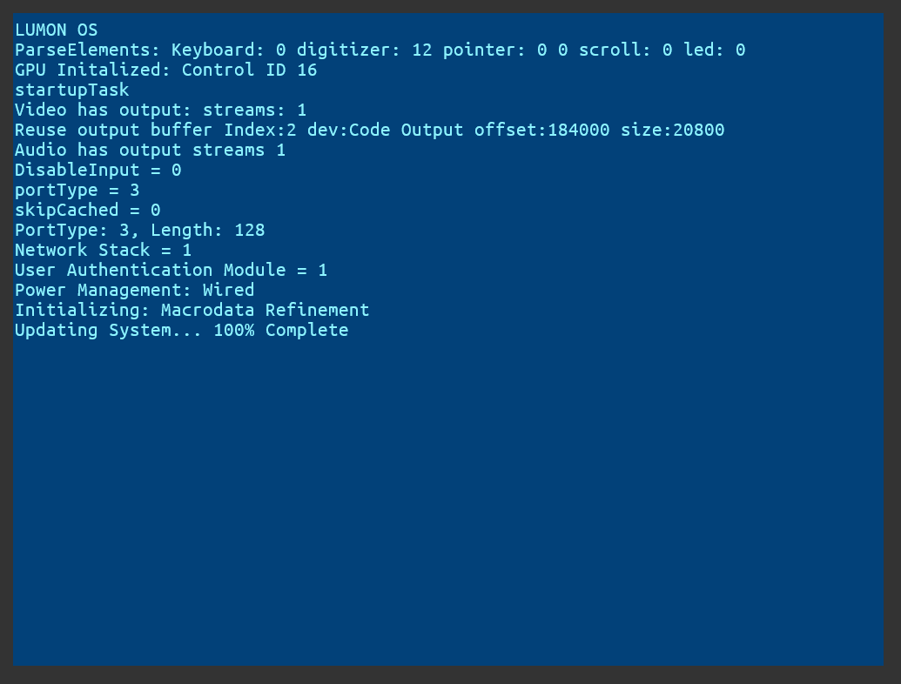
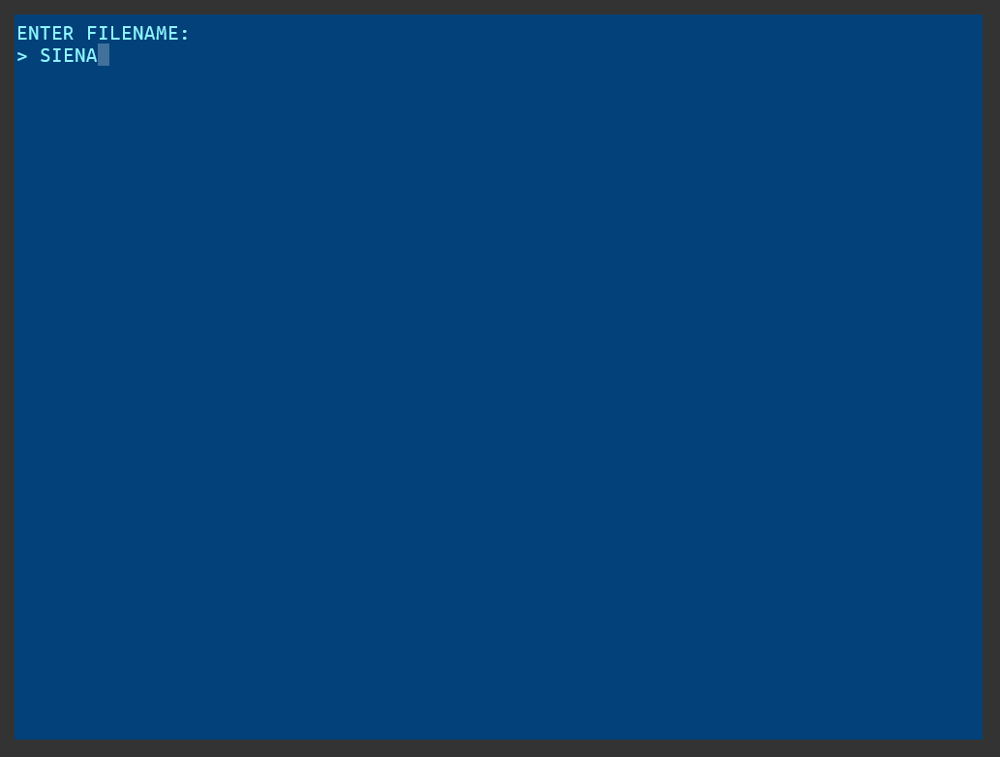
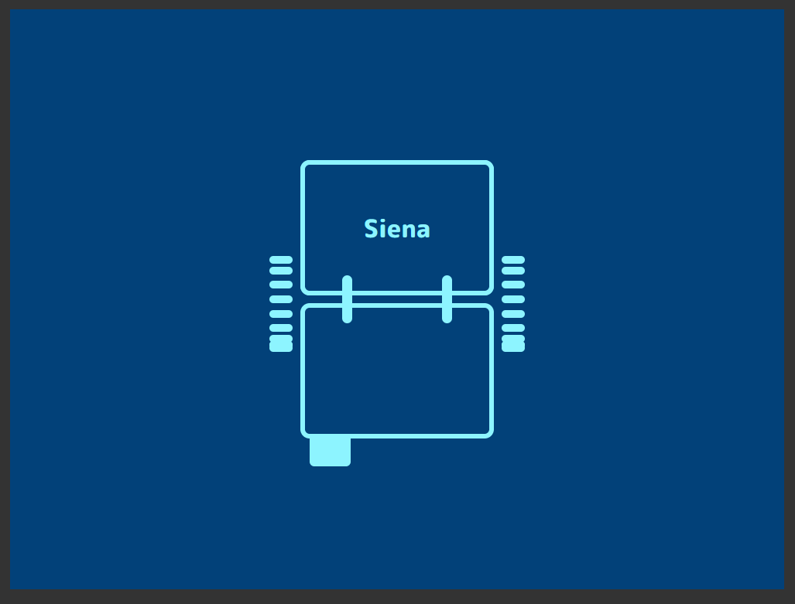
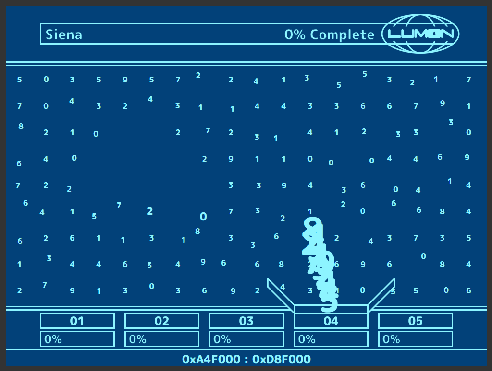

# TheFourTempers

Master the four tempers as did Kier, and "the world shall become but your appendage."

# Demo

[Demo](https://strawstack.github.io/TheFourTempers/)

# Video

[Video](https://youtu.be/C3lXoiiYxRY)

# Screenshot

# Controls

Mouse move: Magnify numbers in the grid.

Mouse left down: Select number.

Mouse left down (and drag): Select multiple numbers.

Mouse left up: Clear selection.

WASD: Pan the number grid.

Arrow Up: Zoom in.

Arrow Down: Zoom out. 

Number Keys 1 to 5: Open corrisponding bin.

B (with active selection and open bin): Send selection to open bin. 

# Screenshots

